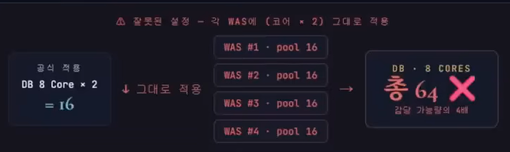

# DB Connection Pool 몇 개로 설정해야 할까?
https://www.youtube.com/watch?v=uhMhv8yGAyM&list=LL
좋은 내용 감사합니다 :)

## DB Connection Pool이란 ?
> DB 커넥션을 미리 만들어두고, 필요할 때 빌려쓰고, 다 쓰면 반납하는 형식

### 왜 필요할까?
- DB 커넥션은 새로 만들 떄 비용이 많이 든다.
- 한번 생성에 보통 수 ms ~ 수십 ms 이상(TCP/TLS/인증 누적)
- PostgreSQL은 프로세스 기반이라 커넥션 수가 늘면 메모리도 함께 증가
- 환경에 따라 커넥션당 수 MB ~ 수십 MB
- 매 요청마다 새로 만들면 누적 오버헤드와 부하로 시스템이 견디지 못함.

### Connection은 비싼 자원
DB 커넥션을 하나 만드는데 필요한 일들:
1. TCP 3-way handshake - 네트워크 왕복
2. SSL/TLS 협상 - 보안 적용 시
3. DB 인증 - 사용자/비밀번호 인증
4. 백엔드 프로세스 할당 - PostgresSQL은 커넥션당 별도 프로세스

> 비용 : 한버 생성에 보통 수 ms ~ 수십 ms 이상. TCP/TLS/인증 누적이라 환경 따라 차이 큼 
> PostgreSQL은 프로세스 기반 구조라 커넥션 수 증가 시 메모리도 함께 증가 - 커넥션당 수 MB ~ 수십MB

## 우리는 어떤 기준으로 결정할까?
1. 수정 없이 기본값 그대로 - 라이브러리 기본값이면 충분하겠지 - 설정에 손대지 않음
2. 경험, 감으로 n ~ m개 사이 - 예전 프로젝트에서 50 썼으니까 이번에도...
3. 업계 표준 공식 참조 - 코어 * 2 같은 가이드를 적용 - 검증된 출발점 활용
4. 부하테스트로 검증 후 결정 - 측정해서 sweet spot을 찾음 - 환경별 실측 기반

### 진영마다 표준 라이브러리가 있고, 기본값은 모두 작다.
- Java HikariCP : maximumPoolSize = 10
- .Net을 제외하면 모두 5 ~ 15 사이. 이 숫자에 기술적 근거가 있다는 뜻.

## 실무 Pool 사이즈 분포
- 10 : 개발 / 스테이징
- 10-20 : 소규모 운영 (4~8코어 일반 API 서버 - 가장 흔한 설정)
- 20-30 : 중규모 운영 (16코어 이상, 트래픽이 많은 서비스)
- 30-50 : 고트래픽 운영 (대규모 부하 테스트로 검증된 후)
- 100+ : 흔한 안티패턴 (여유있게 잡고 방치 - 장애 흔한 원인)

### 셀프 체크
1. 현재 maximumPoolSize = ?
2. DB 서버 코어 수 = ?
3. 부하 테스트 시 평균 active 커넥션 = ?
> 권장 시작점 = DB 코어 * 2
> 현재값과의 차이가 2배 이상이라면 점검 대상. 특히 100 이상이면 재검토 권장
> 참고 : HikariCP 위키 벤치마크 : PostgreSQL에서 약 50 커넥션 부근부터 TPS 평탄화 (특정 환경 기준, 임계점은 환경마다 다름)
> Oracle Real-world Performance 권장 : CPU 코어당 평균 10개 이하. 실무에서는 작은 숫자가 출발점.

### 흔한 오해 - Pool 크기를 키우면 처리량도 늘겠죠?
- 일정 수를 넘기면 처리량은 오히려 떨어진다. 커넥션을 늘릴수록 시스템이 일을 못한다.
- Oracle 공식 문서 : "커넥션을 줄이면 CPU 부담이 줄고 처리량이 오히려 늘어난다. - 역설적으로 보이지만 사실"
- 세션 수가 줄어들면 데이터베이스 내부에서 발생하는 경합 관련 대기 이벤트도 줄어든다. 연결 수가 감소하면 이전에 래치 처리 및 경합 중재에 소모되던 CPU 자원이 데이터베이스 트랜잭션 처리에 더 많은 시간은 할애할 수 있게 된다.
- 연결 수가 줄어들면 CPU에서 연결이 더 오랫동안 스케줄링될 수 있다. 결과적으로 이러한 프로세스와 관련된 모든 메모리 페이지는 CPU 캐시에 상주하게 된다. 따라서 스케줄링 효율성이 강화되고 메모리에 정체되는 시간이 줄어든다.

## 핵심공식 - Pool 크기는 어디서 출발하나
```
Pool Size = ( Core_count * 2 ) + effective_spindle_count 
```
### counr_count
- DB 서버의 물리 CPU 코어 수
- 앱 서버 아닌 DB 서버 기준 : Hyperthreading 제외 - 8코어 16스레드 CPU라면 core_count = 8

### effective_spindle_count
- 디스크 회전축 수
- 데이터가 메모리에 다 들어가거나 SSD면 0에 가까움. HDD는 디스크 개수만큼.

> 중요 : 이 공식은 PostgreSQL 커뮤니티에서 널리 알려진 경험적 시작점. 절대값이 아니라 부하테스트의 출발점. 실제 워크로드에 따라 적정값이 달라진다.

> 또다른 공식 - 데드락 회피 Tn * (Cm - 1) + 1
> Tn = 동시 스레드 수, Cm = 한 스레드가 동시에 잡는 커넥션 수
> 한 요청이 커넥션 여러 개를 동시에 잡는 코드(중접 트랜잭션 등)에서 데드락을 피하는 최소값이다. 일반적인 벡엔드(Cm= 1, 한 요청 = 한 커넥션)에서는 Tn * 0 + 1 = 1이 되어 의미가 없고,
> 풀 사이즈는 위의 처리량 공식에 따른다. 주로 데드락 발생 시 진단 도구로 활용.

### 왜 코어 * 2인가?
- 쿼리는 CPU 처리 <-> I/O 대기가 번갈아 일어난다. I/O 대기 동안 코어가 놀지 않도록 한 쿼리분 여유를 더 둔 것.

## 커넥션이 많아질수록 느려지는 3가지 이유
> USL (Universal Scalability Law)
> "동시 처리 단위 N을 늘릴수록 자원 경쟁(a)과 일관성 비용(베타)이 누적되어, 어느 지점부터 처리량이 오히려 감소한다. -> TPS 강의의 Saturation Point가 바로 이 지점이다."

### Context Switching 폭증
CPU 코어가 8개인데 동시에 일하는 스레드가 200개라면? CPU는 일을 안하고 스레드를 바꾸느라 시간을 다쓴다. 스레드 교체 시 CPU 캐시도 무효화되어 메모리 접근이 늘어난다.

### Lock 경쟁 증가
같은 테이블, 같은 행을 노리는 스레드가 많아질수록 락 대기 시간이 늘어난다. 처리 시간보다 대기 시간이 길어지는 역전이 발생한다.

### 캐시 효율 저하
많은 커넥션이 각 자 다른 데이터를 읽으면 DB의 메모리 캐시(shared_buffers)가 빠르게 교체된다. 캐시 미스가 늘어 디스크 I/O가 증가.

> 동시에 일하는 커넥션은 CPU가 처리할 수 있는 양만큼만 의미가 있다.

## 풀이 부족한가? 쿼리가 느린가?
> TPS = 활성 커넥션 / 쿼리 실행 시간 = (동시 접속자 / 응답시간)
> 
> 동시 접속자(CU)가 같아도 응답 시간(MRT)이 길어지면 시스템 처리량(TPS)는 폭락한다.

### 측정 - APM, 부하테스트로 확인
풀 16, 활성 커넥션 평균 15, 쿼리 50ms, 실측 280TPS

### 분기 - 풀을 늘리면 활성 커넥션이 더 늘어날까?

- Case 1 코어 한계 도달 : 활성 커넥션이 코어 * 2 부근이라면 ?
  - 풀을 늘려도 활성 커넥션은 거의 그대로 (USL)
  - 쿼리 단축이 답 !!!!
- Case2 코어 여력 있음 : CPU 사용률에 여유가 있다면 ?
  - 활성 커넥션이 더 늘 여지 있음.
  - 풀 확장도 함께 검토

### 처방
- 1순위 : 쿼리 50ms -> 25ms 단축 시
  - 14 / 0.025 = 560 TPS (2배)
- 2순위 : 코어 여력이 남아있으면 풀 확장도 함께 검토

> 핵심 : Little's Law는 풀 크기를 정해주는 공식이 아니라, 풀 부족과 쿼리 부족을 구별하는 진단 도구. 쿼리 튜닝, 인덱스, 캐시가
> 풀 사이징보다 효과적인 경우가 많다.

## 시나리오 적용 - 8코어 단일 노드 시연
```
DB 서버 사양 : 8코어 (HT 제외)
디스크 : SSD + 충분한 RAM
트랜잭션 패턴 : 한 요청 = 1 커넥션
p50 쿼리 시간 : 50ms
목표 TPS : 300
구성 : WAS 단일 인스턴스
```

```
1. 처리량 공식으로 시작점 잡기
(DB 코어 8 * 2) + 0 = 16
-> SSD라 spindle = 0. 시작점은 16개

2. Little's Law로 처리 능력 검증
활성 16 / 0.05 = 320 TPS (이론 상한)
-> 실효 80% = 256 TPS, 목표 300은 다소 빡셀듯

3. 시작값 16으로 부하 테스트 -> Sweet spot 탐색
maximumPoolSize = 16부터 시작
-> HikariCP 메트릭(active, waiting) 모니터링하며 단계적 조정

4. 목표 미달 시 - 풀 키우기는 마지막 옵션
- 쿼리 인덱스 최적화로 p95 단축
- 풀을 18 ~ 20까지 점진 확장 (USL 임계점 주의)
- 그래도 부족하면 DB 자원 증서 (코어 추가, Read Replica)
```

## 다중 WAS 환경 - 풀을 곱하지 마라

```
위와 같이 설정하면 X
DB가 감당 가능한 양의 4배
컨텍스트 스위칭 폭증, max_connections 초과로 "FATAL: too many connections" 발생.

안정적 접근
총량 16을 인스턴스에 분배
각 WAS = (코어 * 2) / 2
= 16 / 4 = 4개

현실적 조정 : 단순 분배는 1대 장애시 다른 WAS가 부담을 떠안는 위험이 있다. 약간의 여유는 두되,
합계가 (DB 코어 * 2)를 크게 넘지 않게 :
- DB 보호 우선 : 4개씩 (총 16, USL 안전)
- 가용성 우선 : 5 ~ 6개씩 (총 20 ~ 24, 1대 장애 허용)
실제 값은 부하 테스트로 검증. "피크 WAS 수" 기준으로 분배.
```
> 오토스케일링 환경 : Pod 수가 동적으로 변하면 매번 풀 사이즈를 조정할 수 없다.
> pgBouncer 같은 외부 풀러로 DB 측 통합 관리가 정석. 외부 풀러 없이 가려면 풀을 작게 고정 + 부하테스트로 검증

## 그래서 실무에 바로 적용하는가?
잘 돌아가는 프로그램의 갑자기 풀 축소를 하지는 말 것 -> 트래픽 폭증 시 장애 발생 가능.

1. 각 평균 active 커넥션 측정 필수
각 서버에서 HikariCP 메트릭으로 피크 시간대의 active를 확인
-> hikaricp.connections.active, hikaricp.connections.pending
-> Spring Boot actuator, Micrometer + Prometheus등으로 수집
2. 측정값으로 적용 가능 여부 판단 (각 WAS의 자기 풀 기준)
각 WAS의 평균 active / 그 WAS의 풀 사이즈 = 사용률
- 25% 이하 (예 : 풀 10에 active 2.5개 이하) : 풀 축소 안전
- 25 ~ 60& : 신중히 적용, 부하 테스트 병행
- 60% 이상 : 풀이 의미 있게 사용 중 - 섣불리 줄이지 말고 부하 원인 분석 우선
- 다중 was : 인스턴스별 편차 확인 + 합계가 db 한계 안인지 별도 점검
3. 단계적 적용 + 모니터링
한번에 큰 폭으로 줄이지 말고, 점진적으로 감소시키며 메트릭 관찰
-> active, pending, 응답시간, 에러율 변화 추적
4. 즉시 롤백 가능하도록 준비
설정 변경은 배포 절차로 - 문제 발생 시 즉시 이전 값으로 복원

## DB의 max_connections 한계를 넘으면 안된다.
```
모든 was의 풀 사이즈 > db의 max_connections

PostgreSQL: 100, MySQL: 151
시스템 예약 3 ~ 10개 제외하면 90개

보통 max_connections * 0.8 
- superuser 예약 (3-5개)
- 모니터링,DBA 도구 접속
- 배치, Replication 운여 여유

흔한 장애 시나리오
설정 : WAS 5대 * maxPool 30 = 합계 150 / DB : max_connections = 100
장애 발생 : 합계 커넥션이 100 도달 시점
- Fixed Pool (HikariCP 권장) : 시작 즉시 발생 -> Pod 시작 실패 -> 무한 재시작 루프
- Dynamic Pool : 트래픽 폭증 시 발생 -> 일부 요청 "FATAL: too many connections"
```
> max 커넥션을 그냥 올리면 부분적으로는 가능하지마 한계가 있다. PostgreSQL은 프로세스 기반이라
> 커넥션마다 수 MB ~ 수십 MB 메모리, 컨텍스트 스위칭 비용도 누적, 그래서 운영 가이드는
> pgBouncer 도입 을 권장 

## 실무에서 마주치는 4가지 함정
### Long Transaction
- 트랜잭션 안에서 외부 API 호출, 무거운 계산 등을 하면 커넥션 점유 시간이 길어짐.
- 공식은 다 맞아도 실제로는 풀이 마름.
- 해법 : 외부 호출은 트랜잭션 밖으로 빼기

### 유휴 커넥션 timeout 미스매치 
- HikariCP maxLifetime 이 DB의 idle timeout보다 길면, DB가 먼저 끊은 커넥션을
풀이 그대로 쥐고 있다가 "connections is closed" 에러 발생
- 해법 : maxLifeTime을 DB의 idle timeout 보다 30초 이상 짧게 설정

### Cm > 1인 코드
- 한 메서드 안에서 여러 커넥션을 동시에 점유하는 패턴. 풀 크기를 키우는 것 보다 코드 구조 변경
- 해법 : 트랜잭션 분리, 또는 JTA 활용으로 같은 트랜잭션 내 커넥션 재사용.

### Leak Detection
- 개발/운영 환경에서 커넥션 누수 잡기.
- leakDetectionThreadshold = 60000 (60초)를 켜듀면 풀로 반환되지 않은 커넥션을 로그로 알려준다.
```yaml
spring:
  datasource:
    hikari:
      leak-detection-threshold: 60000   # ms, 60초 
```
> 풀 크기를 키우면 해결되겠지 라는 잘못된 처방. 대부분의 풀 고갈은 풀 크기 문제가 아니다.

## 출근 후 점검할 8가지
- maximumPoolSize는 (코어 * 2) 부터 시작. 임의로 50, 100 설정하지 않기.
- Fixed Pool로 운영 - minimumIdle을 maximumPoolSize와 같게 설정 (HikariCP 권장). 런타임 풀 변동 오버헤드 감지
- connectionTimeout 30초 (기본값 유지). 너무 길면 장애시 회복이 늦다.
- leackDetectionThreshold를 60초로 설정해 커넥션 누수 조기 발견.
- 트랜잭션 안의 외부 API 호출 코드를 모두 찾아내 분리. 가장 흔한 풀 고갈 원인.
- HikariCP 매트릭(active, idle, waiting) 모니터링 대시보드 구축
- DB max_connections vs (인스턴스 수 * maxPool) 합 비교, 초과 시 외부 풀러 도입
- 부하 테스트로 Saturation Point 측정. 풀 크기를 바꿔가며 실제 TPS 곡선 확인.