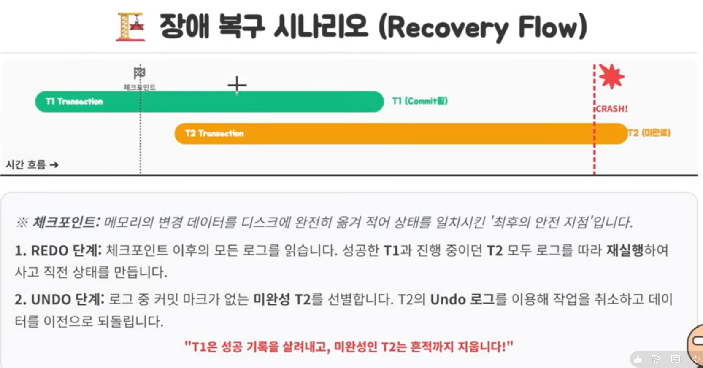

# Redo vs Undo
> DB 장애 발생 시 복구 과정에서 Redo와 Undo 로그는 각각 어떤 역할을 하나요?
> "A(원자성)"과 "D(지속성)"의 물리적 구현을 완벽 이해한다.

## REDO Log : "성공한 건 살리자"
- 트랜잭션이 커밋(Commit)되어 사용자는 안심했는데, 디스크 반영 전 서버가 꺼진 경우
- 로그에 담긴 "변경 후 데이터(After Image)"를 보고 다시 실행해서 결과를 복구한다.
- "성공한 트랜잭션의 영원한 보존을 책임진다."

## UNDO Log : "실패한 건 지우자"
- 원자성(Atomicity) & 고립성(Isolation)
- 트랜잭션 도중 오류가 나거나 사용자가 롤백(Rollback)을 요청한 경우
- 로그에 담긴 "변경 전 데이터(Before Image)"를 보고 이전 상태로 되돌린다.
- "MVCC 구현 시 : 다른 사용자에게 수정 전의 올바른 데이터를 보여주는 용도."

## WAL: "로그가 데이터보다 먼저다"
데이터베이스 성능과 안전을 동시에 챙기는 핵심 전략
1. 메모리 데이터 변경
2. 로그 파일에 기록 (Redo/Undo)
3. 데이터 파일 반영 (Lazy Write)

> 왜 로그를 먼저 쓰나요?
> - 성능 : 데이터 파일 전체를 무작위로 뒤지는 것보다 로그 끝에 순차적으로 덧붙이는 것이 훨씬 빠르다.
> - 안전 : 데이터 파일 변경 전 사고가 나도, 로그만 있으면 복구할 수 있다.

## 장애 복구 시나리오

## 주요  DBMS 별 구현 방식

### MySQL (Inno DB)
- Redo 구현 : Redo Log File(ib_logfile)
- Undo 구현 : Undo Segment (언두 영역)

### Oracle
- Redo Log Files (Online Redo)
- Undo Tablespace (전용 공간)

### PostgreSQL
- WAL (XLOG) 지속성 전용
- 물리적 로그 없음(MVCC로 해결)
- PostgreSQL은 데이터를 덮어쓰지 않는 MVCC 구조 덕분에 별도의 Undo 파일이 필요 없음.

## Redo vs Undo 결정적 차이

| 항목 | REDO | UNDO |
|--|--|--|
| 저장 내용 | 변경 후의 값 (After Image) | 변경 전의 값 (Before Image) |
| 트랜잭션 타겟 | 성공(Commit)한 트랜잭션 | 실패/진행중  트랜잭션 |
|기여하는 ACID | 지속성 (Durability | 원자성(A) & 고립성 (I) |
|핵심 비유 | 작업 일지 재현 (Replay) | 작업 취소 |

## 정리
- Redo는 성공한 트랜잭션의 지속정을 위해 '변경 후의 값'을 기록하며, 장애 후 데이터를 재현하는데 사용됨.
- Undo는 원자성과 고립성을 위해 '변경 전의 값'을 기록하며, 롤백 시 데이터를 되돌리거나 MVCC에서 과거 버전을 보여주는데 사용
- 복구 시에는 WAL 메커니즘에 의해 Redo를 수행해 사고 직전 상태를 만들고, 커밋되지 않은 트랜잭션을 Undo로 제거하여 최종 무결성을 확보

## 마무리
"성공을 책임지는 Redo, 실패를 수습하는 Undo. 이 두 로그가 있기에 데이터베이스는 안전하다."

